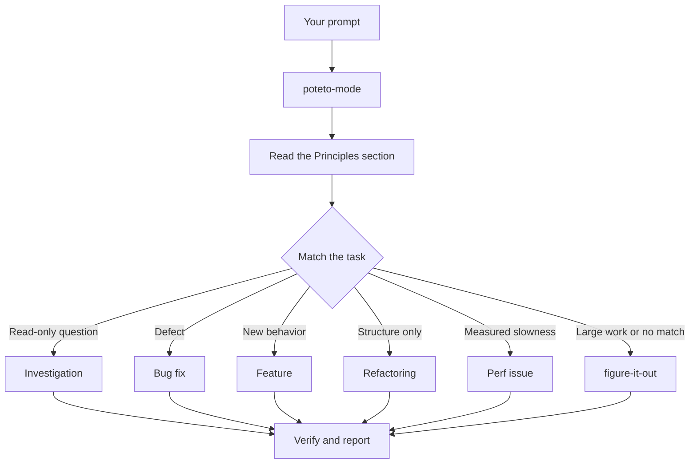

<!-- Generated by scripts/bilingual.py. Source SHA256: 379a1b2c9cd2ba54032b2b142563328d0f3d65039f067863d19b1d4c008737f5 -->
[英文源文件 / English source](../../../guide/02-poteto-mode.md)

<!-- en:0 -->
# Route work through `/poteto-mode`

<!-- zh:0 -->
> **中文**
>
> # 通过 `/poteto-mode` 分派工作

<!-- en:1 -->
`/poteto-mode` is the front door. You give it a goal, it matches one of twenty-three playbooks, copies that playbook's steps into the todo list, and calls the other skills as the steps need them. In this page you learn what a good prompt looks like, and how little of one you actually need.

<!-- zh:1 -->
> **中文**
>
> `/poteto-mode` 是统一入口。你给出目标，它从 23 套执行规程中选择一套，把步骤复制到待办列表，再按步骤需要调用其他 skill。本页说明怎样写有效的提示词，以及提示词实际上可以有多简短。

<!-- en:2 -->


<!-- zh:2 -->
> **中文**
>
> 

<!-- en:3 -->
## What happens to your prompt

<!-- zh:3 -->
> **中文**
>
> ## 提示词如何进入执行流程

<!-- en:4 -->


<!-- zh:4 -->
> **中文**
>
> ```mermaid
> flowchart TD
>     A[你的提示词] --> B[poteto-mode]
>     B --> C[阅读 Principles 部分]
>     C --> D{匹配任务类型}
>     D -->|只读问题| E[调查]
>     D -->|缺陷| F[修复 bug]
>     D -->|新增行为| G[功能实现]
>     D -->|只改结构| H[重构]
>     D -->|已测量的性能问题| I[性能优化]
>     D -->|大型任务或无法匹配| J[figure-it-out]
>     E --> K[验证并报告]
>     F --> K
>     G --> K
>     H --> K
>     I --> K
>     J --> K
> ```

<!-- en:5 -->
The diagram shows the common routes. There are also playbooks for hillclimbing a metric, diagnosing runtime symptoms and captured traces, prototypes, visual parity, authoring and evaluating skills, autonomous runs, babysitting a PR or stack to merge-ready, shipping a verified stack, running a PR queue on autopilot, orchestrating project-scale programs, session pickup, pausing safely, multi-phase plans, and worktree cleanup. The [playbook directory](../../skills/poteto-mode/playbooks/) has the full set.

<!-- zh:5 -->
> **中文**
>
> 图中展示了常见的分派路径。此外还有执行规程用于持续优化某项指标、诊断运行时症状和已采集的 trace、制作原型、对齐视觉效果、编写与评估 skill、自主执行任务、推动 PR 或 PR 栈达到可合并状态、合入已验证的 PR 栈、自动推进 PR 队列、协调项目级工作、接续会话、安全暂停、分阶段计划，以及清理 worktree。完整列表见[执行规程目录](../../skills/poteto-mode/playbooks/)。

<!-- en:6 -->
## Say the goal, not the ceremony

<!-- zh:6 -->
> **中文**
>
> ## 说明目标，不必规定执行仪式

<!-- en:7 -->
You don't write a spec. You say what's wrong or what you want, plus anything you already know that saves the agent time:

<!-- zh:7 -->
> **中文**
>
> 不必先写一份规格说明。说清哪里有问题或你想要什么，再补充已知信息，帮助 agent 少走弯路：

<!-- en:8 -->
```text
/poteto-mode users get two notifications after a retry. repro first, then fix and verify.
```

<!-- zh:8 -->
> **中文**
>
> ```text
> /poteto-mode 重试后，用户会收到两条通知。先复现，再修复并验证。
> ```

<!-- en:9 -->
That's a Bug fix prompt. "repro first" is a real constraint, not politeness, and the playbook honors it. Watch the todo list fill with the Bug fix steps. A skipped step stays visible with `skip: <reason>`.

<!-- zh:9 -->
> **中文**
>
> 这是一个 Bug fix 提示词。“先复现”是明确约束，不是客套话，执行规程会遵守它。你会看到待办列表填入 Bug fix 的步骤。跳过的步骤仍然可见，并标注 `skip: <reason>`。

<!-- en:10 -->
When the conversation already carries the context, the prompt shrinks to almost nothing. All of these are enough:

<!-- zh:10 -->
> **中文**
>
> 如果对话已经包含足够的上下文，提示词可以缩短到几乎只剩一句。下面这些都足够：

<!-- en:11 -->
```text
/poteto-mode do it
```

<!-- zh:11 -->
> **中文**
>
> ```text
> /poteto-mode 开始做吧
> ```

<!-- en:12 -->
```text
continue
```

<!-- zh:12 -->
> **中文**
>
> ```text
> 继续
> ```

<!-- en:13 -->
```text
keep going until done
```

<!-- zh:13 -->
> **中文**
>
> ```text
> 一直做，直到完成
> ```

<!-- en:14 -->
Short works because the mode is sticky and the playbook holds the structure. Your words carry the intent, and the skill carries the rigor.

<!-- zh:14 -->
> **中文**
>
> 简短提示词之所以有效，是因为工作模式持续生效，执行规程负责维持步骤结构。你表达意图，skill 保证执行过程的严谨性。

<!-- en:15 -->
## Switch tasks with "new task"

<!-- zh:15 -->
> **中文**
>
> ## 用“新任务”切换任务

<!-- en:16 -->
A long chat accumulates context from the last task. When you change subjects, say so:

<!-- zh:16 -->
> **中文**
>
> 长对话会不断积累上一个任务的上下文。要换话题时，请明确说明：

<!-- en:17 -->
```text
/poteto-mode new task. figure out why the cache entry survives logout. don't change any code yet.
```

<!-- zh:17 -->
> **中文**
>
> ```text
> /poteto-mode 新任务。查清为什么退出登录后缓存项还存在。暂时不要改代码。
> ```

<!-- en:18 -->
"new task" tells `/poteto-mode` to re-match rather than continue the prior playbook. "don't change any code yet" pins this one to Investigation. Without those two phrases, a mode mid-Feature tends to treat your question as the next feature step.

<!-- zh:18 -->
> **中文**
>
> “新任务”告诉 `/poteto-mode` 重新匹配执行规程，而不是继续原来的流程。“暂时不要改代码”则把这个任务限定为 Investigation。如果不说这两句，正在执行 Feature 流程的模式容易把你的问题当成下一项功能步骤。

<!-- en:19 -->
## Give parallel work its own worktree

<!-- zh:19 -->
> **中文**
>
> ## 为并行任务分配独立 worktree

<!-- en:20 -->
If you run several agents against one repository, they will fight over the working tree. Ask for isolation up front:

<!-- zh:20 -->
> **中文**
>
> 如果多个 agent 同时操作同一个仓库，它们会争用工作树。一开始就要求隔离：

<!-- en:21 -->
```text
/poteto-mode new task. branch off <base> in a fresh worktree, then port the parser change there.
```

<!-- zh:21 -->
> **中文**
>
> ```text
> /poteto-mode 新任务。在新的 worktree 中从 <base> 创建分支，再把 parser 改动移植过去。
> ```

<!-- en:22 -->
Each task in its own branch and worktree means no agent stomps another's files. The [Opening a PR playbook](../../skills/poteto-mode/playbooks/opening-a-pr.md) already works from a worktree for code changes, so mostly you only say this when a specific base or location matters.

<!-- zh:22 -->
> **中文**
>
> 每个任务都有独立分支和 worktree，就不会覆盖其他 agent 的文件。[Opening a PR 执行规程](../../skills/poteto-mode/playbooks/opening-a-pr.md) 在修改代码时本就使用 worktree，因此通常只有对基线或位置有明确要求时，才需要补充这句话。

<!-- en:23 -->
Worktrees accumulate. When disk gets tight, ask:

<!-- zh:23 -->
> **中文**
>
> worktree 会越积越多。磁盘空间紧张时，可以这样问：

<!-- en:24 -->
```text
/poteto-mode what's eating my disk? prune the worktrees that are safe to prune.
```

<!-- zh:24 -->
> **中文**
>
> ```text
> /poteto-mode 是什么占满了磁盘？清理那些确认可以安全删除的 worktree。
> ```

<!-- en:25 -->
The [Worktree cleanup playbook](../../skills/poteto-mode/playbooks/worktree-cleanup.md) classifies every worktree by merge state, uncommitted work, and which chats still touch it. It deletes only what that evidence clears and pauses for your call on anything holding uncommitted work.

<!-- zh:25 -->
> **中文**
>
> [Worktree cleanup 执行规程](../../skills/poteto-mode/playbooks/worktree-cleanup.md) 会根据合并状态、未提交的工作，以及仍在操作该 worktree 的对话，对每个 worktree 分类。它只删除证据明确支持删除的项；只要某项还有未提交的工作，就会暂停并交由你决定。

<!-- en:26 -->
## Leave it running

<!-- zh:26 -->
> **中文**
>
> ## 让任务继续执行

<!-- en:27 -->
When you step away, say what done means and go:

<!-- zh:27 -->
> **中文**
>
> 你要离开时，说明什么算完成，然后就可以离开：

<!-- en:28 -->
```text
/poteto-mode im stepping away. keep going until the migration check reports zero old callers. log your decisions.
```

<!-- zh:28 -->
> **中文**
>
> ```text
> /poteto-mode 我要离开一会儿。持续执行，直到迁移检查报告旧调用方数量为零。记录你的决策。
> ```

<!-- en:29 -->
Work you'll review later routes through [`/figure-it-out`](../../skills/figure-it-out/SKILL.md), which designs the run's phases and keeps a [`/show-me-your-work`](../../skills/show-me-your-work/SKILL.md) decision log. [Run work while you sleep](./07-overnight.md) covers the full overnight contract.

<!-- zh:29 -->
> **中文**
>
> 需要事后复核的任务会转交 [`/figure-it-out`](../../skills/figure-it-out/SKILL.md)，由它设计执行阶段，并通过 [`/show-me-your-work`](../../skills/show-me-your-work/SKILL.md) 留下决策记录。[让任务在你休息时继续](./07-overnight.md) 会介绍完整的夜间执行约定。

<!-- en:30 -->
**Pitfall:** don't enumerate skills in your prompt ("use /how, then /architect, then /arena..."). The playbook already sequences them, and a hand-written sequence usually reorders or drops steps the playbook would have kept. Name a skill only when you want to override a specific choice.

<!-- zh:30 -->
> **中文**
>
> **易错点：** 不要在提示词中逐一安排 skill，例如“先 /how，再 /architect，然后 /arena……”。执行规程已经规定顺序，手写顺序往往会打乱或遗漏原本应保留的步骤。只有想覆盖某个具体选择时，才明确指定 skill。

<!-- en:31 -->
Read [`poteto-mode`](../../skills/poteto-mode/SKILL.md) itself for the full routing rules.

<!-- zh:31 -->
> **中文**
>
> 完整的分派规则见 [`poteto-mode`](../../skills/poteto-mode/SKILL.md) 本身。

<!-- en:32 -->
Next: [Understand the code](./03-understand.md).

<!-- zh:32 -->
> **中文**
>
> 下一页：[理解代码](./03-understand.md)。
