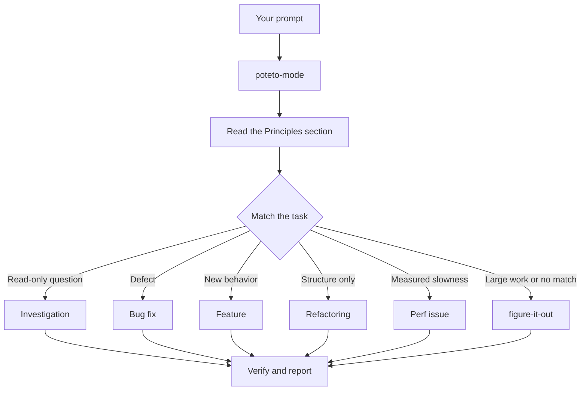
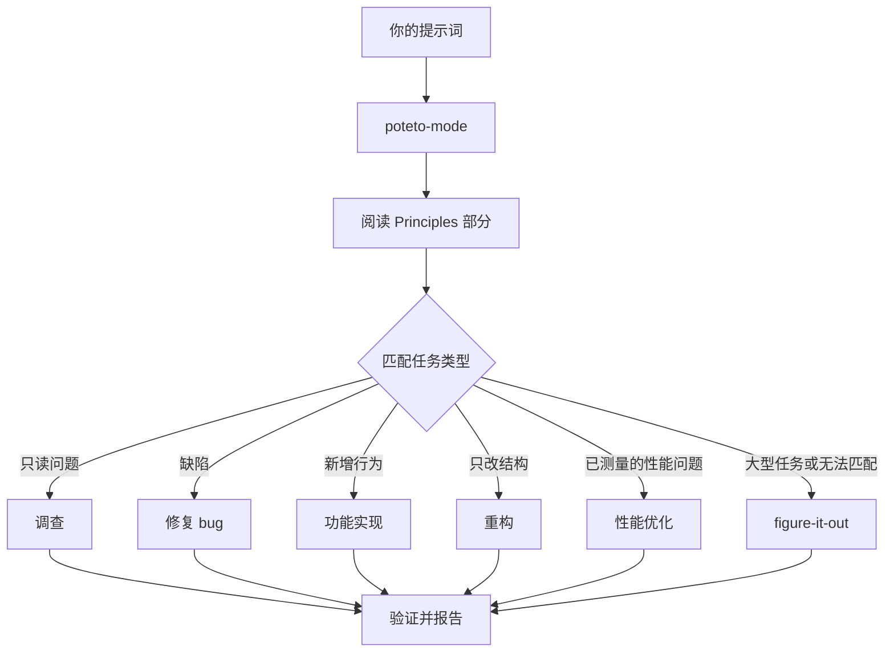

<!-- Generated by scripts/bilingual.py. Source SHA256: 979f61ca3d44cb8e68affda40327d32797e93fa9cc53ced7444c15e2600897e1 -->
[英文源文件 / English source](../../../guide/02-poteto-mode.md)

<!-- en:0 -->
# Route work through `/poteto-mode`

<!-- zh:0 -->
**通过 `/poteto-mode` 分派工作**

<!-- en:1 -->
`/poteto-mode` is the front door. You give it a goal, it matches one of twenty-three playbooks, copies that playbook's steps into the todo list, and calls the other skills as the steps need them. In this page you learn what a good prompt looks like, and how little of one you actually need.

<!-- zh:1 -->
`/poteto-mode` 是统一入口。你给出目标，它从 23 套执行规程中选择一套，把步骤复制到待办列表，再按步骤需要调用其他 skill。本页说明怎样写有效的提示词，以及提示词实际上可以有多简短。

<!-- en:2 -->


<!-- en:3 -->
## What happens to your prompt

<!-- zh:3 -->
**提示词如何进入执行流程**

<!-- en:4 -->


<!-- zh:4 -->


<!-- en:5 -->
The diagram shows the common routes. There are also playbooks for hillclimbing a metric, diagnosing runtime symptoms and captured traces, prototypes, visual parity, authoring and evaluating skills, autonomous runs, babysitting a PR or stack to merge-ready, shipping a verified stack, running a PR queue on autopilot, orchestrating project-scale programs, session pickup, pausing safely, multi-phase plans, and worktree cleanup. The [playbook directory](../../skills/poteto-mode/playbooks/) has the full set.

<!-- zh:5 -->
图中展示了常见的分派路径。此外还有执行规程用于持续优化某项指标、诊断运行时症状和已采集的 trace、制作原型、对齐视觉效果、编写与评估 skill、自主执行任务、推动 PR 或 PR 栈达到可合并状态、合入已验证的 PR 栈、自动推进 PR 队列、协调项目级工作、接续会话、安全暂停、分阶段计划，以及清理 worktree。完整列表见[执行规程目录](../../skills/poteto-mode/playbooks/)。

<!-- en:6 -->
## Say the goal, not the ceremony

<!-- zh:6 -->
**说明目标，不必规定执行仪式**

<!-- en:7 -->
You don't write a spec. You say what's wrong or what you want, plus anything you already know that saves the agent time:

<!-- zh:7 -->
不必先写一份规格说明。说清哪里有问题或你想要什么，再补充已知信息，帮助 agent 少走弯路：

<!-- en:8 -->
```text
/poteto-mode users get two notifications after a retry. repro first, then fix and verify.
```

<!-- zh:8 -->
```text
/poteto-mode 重试后，用户会收到两条通知。先复现，再修复并验证。
```

<!-- en:9 -->
That's a Bug fix prompt. "repro first" is a real constraint, not politeness, and the playbook honors it. Watch the todo list fill with the Bug fix steps. A skipped step stays visible with `skip: <reason>`.

<!-- zh:9 -->
这是一个 Bug fix 提示词。“先复现”是明确约束，不是客套话，执行规程会遵守它。你会看到待办列表填入 Bug fix 的步骤。跳过的步骤仍然可见，并标注 `skip: <reason>`。

<!-- en:10 -->
## What goes in a prompt

<!-- zh:10 -->
**提示词中写什么**

<!-- en:11 -->
A useful prompt carries up to five things, and each one fits in a sentence:

<!-- zh:11 -->
一个有用的提示词最多包含五项，每项一句话就够：

<!-- en:12 -->
- **The goal.** Say what's wrong, or what you want.
- **The done check.** It must be able to pass or fail. "Make it better" and "work on it for an hour" aren't checks.
- **The proof you want to see.** Ask for the real command output, a video of the flow, the stored value, or a before-and-after number.
- **What you already know.** A symptom, a repro step, a log line, or a link saves the agent a search.
- **The real constraints.** "repro first", "don't change any code yet", "zero behavior change", and "let me review before proceeding" each change what the agent does.

<!-- zh:12 -->
- **目标。** 说明哪里有问题，或你想实现什么。
- **完成检查。** 必须能判断通过或失败。“让它更好”和“做一个小时”都不是检查。
- **希望看到的证据。** 要求真实命令输出、操作流程视频、存储值或前后对比数据。
- **已知信息。** 症状、复现步骤、日志行或链接都能省去 agent 的一次搜索。
- **实际约束。** “先复现”“暂时不要改代码”“行为完全不变”“继续之前先让我审查”都会改变 agent 的做法。

<!-- en:13 -->
Here's one prompt with all five:

<!-- zh:13 -->
下面这个提示词包含全部五项：

<!-- en:14 -->
```text
/poteto-mode the csv export drops its last row since yesterday's deploy. failing job id is 4812. repro first, then fix. done means the 60k-row fixture exports every row. show me the row counts before and after.
```

<!-- zh:14 -->
```text
/poteto-mode 昨天部署后，csv 导出会丢失最后一行。失败任务 id 为 4812。先复现，再修复。完成条件是包含 6 万行的测试数据能导出每一行。给我看修复前后的行数。
```

<!-- en:15 -->
Two things are worth leaving out:

<!-- zh:15 -->
有两项最好先不写：

<!-- en:16 -->
- **The how.** Say what to achieve, and leave the agent room to find a better path than the one you'd pick. The same goes for a list of skills, covered in the pitfall below.
- **Your theory of the cause, at first.** A stated guess narrows the search to wherever you pointed. Let the agent restate the problem before you share your hunch.

<!-- zh:16 -->
- **具体做法。** 说明要实现什么，给 agent 留出空间，找到比你预想更好的路径。下面的误区部分会说明，列出一串 skill 也是同样的问题。
- **你对根因的猜测。** 一开始就提出猜测，会将搜索范围限制在你指向的位置。先让 agent 复述问题，再分享你的直觉。

<!-- en:17 -->
For a noisy report, such as a long thread or a vague bug, make the restatement the first step:

<!-- zh:17 -->
面对信息杂乱的报告，比如很长的讨论串或模糊的 bug，先要求复述问题：

<!-- en:18 -->
```text
/poteto-mode read this thread. restate the underlying issue in your own words, in plain english. don't change any code yet.
```

<!-- zh:18 -->
```text
/poteto-mode 阅读这个讨论串，用你自己的话，以通俗语言复述根本问题。暂时不要改代码。
```

<!-- en:19 -->
A misreading shows up in the restatement, before any code exists. Correct it there, and it costs you one message instead of one wrong fix.

<!-- zh:19 -->
误读会在写代码前的复述中暴露。此时纠正只需一条消息，不必付出一次错误修复的代价。

<!-- en:20 -->
## Follow up short

<!-- zh:20 -->
**后续提示保持简短**

<!-- en:21 -->
When the conversation already carries the context, the prompt shrinks to almost nothing. All of these are enough:

<!-- zh:21 -->
如果对话已经包含足够的上下文，提示词可以缩短到几乎只剩一句。下面这些都足够：

<!-- en:22 -->
```text
/poteto-mode do it
```

<!-- zh:22 -->
```text
/poteto-mode 开始做吧
```

<!-- en:23 -->
```text
continue
```

<!-- zh:23 -->
```text
继续
```

<!-- en:24 -->
```text
keep going until done
```

<!-- zh:24 -->
```text
一直做，直到完成
```

<!-- en:25 -->
Short works because the playbook holds the structure, and a Custom Mode keeps `/poteto-mode` in context on every turn. [Set up pstack](./01-setup.md#run-your-first-task) shows how to start one. Your words carry the intent, and the skill carries the rigor.

<!-- zh:25 -->
简短提示有效，是因为执行规程提供了流程结构，而自定义工作模式让 `/poteto-mode` 每轮都留在上下文中。[配置 pstack](./01-setup.md#run-your-first-task) 介绍了如何启动。你的话传达意图，skill 提供严谨流程。

<!-- en:26 -->
## Switch tasks with "new task"

<!-- zh:26 -->
**用“新任务”切换任务**

<!-- en:27 -->
A long chat accumulates context from the last task. When you change subjects, say so:

<!-- zh:27 -->
长对话会不断积累上一个任务的上下文。要换话题时，请明确说明：

<!-- en:28 -->
```text
/poteto-mode new task. figure out why the cache entry survives logout. don't change any code yet.
```

<!-- zh:28 -->
```text
/poteto-mode 新任务。查清为什么退出登录后缓存项还存在。暂时不要改代码。
```

<!-- en:29 -->
"new task" tells `/poteto-mode` to re-match rather than continue the prior playbook. "don't change any code yet" pins this one to Investigation. Without those two phrases, a mode mid-Feature tends to treat your question as the next feature step.

<!-- zh:29 -->
“新任务”告诉 `/poteto-mode` 重新匹配执行规程，而不是继续原来的流程。“暂时不要改代码”则把这个任务限定为 Investigation。如果不说这两句，正在执行 Feature 流程的模式容易把你的问题当成下一项功能步骤。

<!-- en:30 -->
## Give parallel work its own machine

<!-- zh:30 -->
**给并行任务各自的机器**

<!-- en:31 -->
If you run several agents against one repository on one computer, they will fight over the working tree, the ports, and the build output. The cleanest isolation is a [cloud subagent](https://cursor.com/docs/subagents#cloud-subagents). Each one gets its own VM and branch, so it can install dependencies, run your app, and record video of the result without touching your machine. Type `/in-cloud` before the task, or ask the parent chat to hand work to cloud subagents.

<!-- zh:31 -->
如果多个 agent 在同一台电脑上操作同一个仓库，它们会争用工作树、端口和构建输出。最彻底的隔离方式是 [云端 subagent](https://cursor.com/docs/subagents#cloud-subagents)。每个 subagent 都有自己的 VM 和分支，可以安装依赖、运行应用并录制结果视频，不影响你的机器。在任务前输入 `/in-cloud`，或要求主对话将工作交给云端 subagent。

<!-- en:32 -->
When the work has to stay local, ask for a worktree up front:

<!-- zh:32 -->
必须在本地执行时，提前要求使用 worktree：

<!-- en:33 -->
```text
/poteto-mode new task. branch off <base> in a fresh worktree, then port the parser change there.
```

<!-- zh:33 -->
```text
/poteto-mode 新任务。在新的 worktree 中从 <base> 创建分支，再把 parser 改动移植过去。
```

<!-- en:34 -->
Each task in its own branch and worktree means no agent stomps another's files. Worktrees cost disk and machine resources, so a laptop runs only a handful at once. The [Opening a PR playbook](../../skills/poteto-mode/playbooks/opening-a-pr.md) already works from a worktree for code changes, so mostly you only say this when a specific base or location matters.

<!-- zh:34 -->
每个任务都有自己的分支和 worktree，就不会覆盖其他 agent 的文件。worktree 会消耗磁盘和机器资源，因此笔记本通常只能同时运行少量任务。[创建 PR 执行规程](../../skills/poteto-mode/playbooks/opening-a-pr.md) 已经要求代码改动在 worktree 中进行，所以通常只有基线或位置有特定要求时，才需要额外说明。

<!-- en:35 -->
Worktrees accumulate. When disk gets tight, ask:

<!-- zh:35 -->
worktree 会越积越多。磁盘空间紧张时，可以这样问：

<!-- en:36 -->
```text
/poteto-mode what's eating my disk? prune the worktrees that are safe to prune.
```

<!-- zh:36 -->
```text
/poteto-mode 是什么占满了磁盘？清理那些确认可以安全删除的 worktree。
```

<!-- en:37 -->
The [Worktree cleanup playbook](../../skills/poteto-mode/playbooks/worktree-cleanup.md) classifies every worktree by merge state, uncommitted work, and which chats still touch it. It deletes only what that evidence clears and pauses for your call on anything holding uncommitted work.

<!-- zh:37 -->
[Worktree cleanup 执行规程](../../skills/poteto-mode/playbooks/worktree-cleanup.md) 会根据合并状态、未提交的工作，以及仍在操作该 worktree 的对话，对每个 worktree 分类。它只删除证据明确支持删除的项；只要某项还有未提交的工作，就会暂停并交由你决定。

<!-- en:38 -->
## Leave it running

<!-- zh:38 -->
**让任务继续执行**

<!-- en:39 -->
When you step away, say what done means and go:

<!-- zh:39 -->
你要离开时，说明什么算完成，然后就可以离开：

<!-- en:40 -->
```text
/poteto-mode im stepping away. keep going until the migration check reports zero old callers. log your decisions.
```

<!-- zh:40 -->
```text
/poteto-mode 我要离开一会儿。持续执行，直到迁移检查报告旧调用方数量为零。记录你的决策。
```

<!-- en:41 -->
Work you'll review later routes through [`/figure-it-out`](../../skills/figure-it-out/SKILL.md), which designs the run's phases and keeps a [`/show-me-your-work`](../../skills/show-me-your-work/SKILL.md) decision log. [Run work while you sleep](./07-overnight.md) covers the full overnight contract.

<!-- zh:41 -->
需要事后复核的任务会转交 [`/figure-it-out`](../../skills/figure-it-out/SKILL.md)，由它设计执行阶段，并通过 [`/show-me-your-work`](../../skills/show-me-your-work/SKILL.md) 留下决策记录。[让任务在你休息时继续](./07-overnight.md) 会介绍完整的夜间执行约定。

<!-- en:42 -->
**Pitfall:** don't enumerate skills in your prompt ("use /how, then /architect, then /arena..."). The playbook already sequences them, and a hand-written sequence usually reorders or drops steps the playbook would have kept. Name a skill only when you want to override a specific choice.

<!-- zh:42 -->
**易错点：** 不要在提示词中逐一安排 skill，例如“先 /how，再 /architect，然后 /arena……”。执行规程已经规定顺序，手写顺序往往会打乱或遗漏原本应保留的步骤。只有想覆盖某个具体选择时，才明确指定 skill。

<!-- en:43 -->
Read [`poteto-mode`](../../skills/poteto-mode/SKILL.md) itself for the full routing rules.

<!-- zh:43 -->
完整的分派规则见 [`poteto-mode`](../../skills/poteto-mode/SKILL.md) 本身。

<!-- en:44 -->
Next: [Understand the code](./03-understand.md).

<!-- zh:44 -->
下一页：[理解代码](./03-understand.md)。
