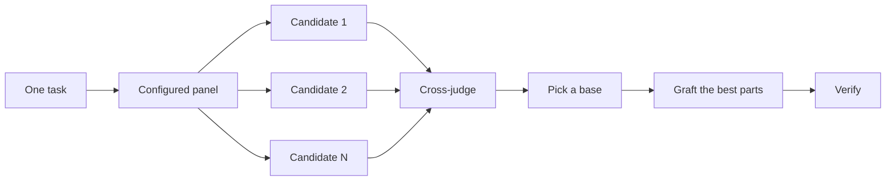

<!-- Generated by scripts/bilingual.py. Source SHA256: 21e820ff73c0b70682aa570a967ede446b4d7caf62e8f391d0dd733ccb74874c -->
[英文源文件 / English source](../../../guide/04-design.md)

<!-- en:0 -->
# Design before you write code

<!-- zh:0 -->
> **中文**
>
> # 写代码之前先设计

<!-- en:1 -->
One attempt at a hard design locks in the first shape the model thought of. `/architect` settles types and boundaries before implementation. `/arena` runs several attempts at the same brief and merges the best parts. `/interrogate` has other models try to break the result. When the job is coverage rather than design synthesis, `/swarm` fans out slices or races and aggregates their results.

<!-- zh:1 -->
> **中文**
>
> 复杂设计如果只尝试一次，很容易固化成模型最先想到的方案。`/architect` 在实现前确定类型与边界。`/arena` 针对同一份任务说明并行尝试多个方案，再综合各方案的长处。`/interrogate` 让其他模型尝试找出结果中的问题。如果目标是扩大检查覆盖，而不是综合设计方案，`/swarm` 会分派不同的任务范围或候选竞赛，再汇总结果。

<!-- en:2 -->


<!-- zh:2 -->
> **中文**
>
> 

<!-- en:3 -->
## Settle the shape with `/architect`

<!-- zh:3 -->
> **中文**
>
> ## 用 `/architect` 确定设计形态

<!-- en:4 -->
```text
/architect design the import pipeline before writing any code. i care most about how callers use it.
```

<!-- zh:4 -->
> **中文**
>
> ```text
> /architect 写代码之前先设计导入流水线。我最关心调用方怎么使用它。
> ```

<!-- en:5 -->
[`/architect`](../../skills/architect/SKILL.md) grounds itself first, running `/how` over the code the design touches and `/why` when it moves ownership or layers. Then it runs `/arena` to produce competing design sketches, with the caller's usage written first in each, followed by types, signatures, and a module map.

<!-- zh:5 -->
> **中文**
>
> [`/architect`](../../skills/architect/SKILL.md) 首先了解现有系统，对设计涉及的代码运行 `/how`；如果改动涉及职责归属或分层，还会运行 `/why`。然后用 `/arena` 产出相互竞争的设计草案。每个草案都先写调用方的使用方式，再给出类型、函数签名和模块关系图。

<!-- en:6 -->
By default it proceeds straight from the synthesized design into implementation. If you want to see the design first, say so:

<!-- zh:6 -->
> **中文**
>
> 默认情况下，综合出设计后，它会直接进入实现。如果你想先查看设计，请明确说明：

<!-- en:7 -->
```text
/architect with checkpoint. stop and show me before implementing.
```

<!-- zh:7 -->
> **中文**
>
> ```text
> /architect 设置检查点。开始实现前停下来，把设计给我看。
> ```

<!-- en:8 -->
## Fan out attempts with `/arena`

<!-- zh:8 -->
> **中文**
>
> ## 用 `/arena` 并行尝试方案

<!-- en:9 -->
```text
/arena take my prompt to the arena verbatim. i want to compare their proposals with yours.
```

<!-- zh:9 -->
> **中文**
>
> ```text
> /arena 把我的提示词原样交给各个候选。我想把它们的方案与你的方案对比。
> ```

<!-- en:10 -->
[`/arena`](../../skills/arena/SKILL.md) is the general tool underneath. N subagents attempt the same design or code brief in parallel, each writing to its own worktree or directory. A read-only judge, on a different model family when your configuration allows one, scores every candidate against a rubric. The coordinator reads each candidate end to end, picks a base, grafts in the best ideas from the losers, and verifies the result.

<!-- zh:10 -->
> **中文**
>
> [`/arena`](../../skills/arena/SKILL.md) 是底层的通用工具。N 个 subagent 并行处理同一份设计或代码任务说明，各自在独立 worktree 或目录中写入产物。只读评审者按照评分标准评估所有候选；配置允许时，评审者使用不同系列的模型。协调者从头到尾阅读每个候选，选择一个作为基础，吸收其他候选中最好的思路，最后验证综合结果。

<!-- en:11 -->


<!-- zh:11 -->
> **中文**
>
> ```mermaid
> flowchart LR
>     A[同一个任务] --> B[已配置的模型组]
>     B --> C[候选 1]
>     B --> D[候选 2]
>     B --> E[候选 N]
>     C --> F[交叉评审]
>     D --> F
>     E --> F
>     F --> G[选择基础方案]
>     G --> H[吸收各方案的长处]
>     H --> I[验证]
> ```

<!-- en:12 -->
The panel comes from your [`/setup-pstack`](../../skills/setup-pstack/SKILL.md) configuration, and you can adjust it per task. Ask for more candidates when the decision matters, fewer when it doesn't:

<!-- zh:12 -->
> **中文**
>
> 模型组由 [`/setup-pstack`](../../skills/setup-pstack/SKILL.md) 配置，也可以针对单个任务调整。决策影响大时增加候选数量，影响小时减少：

<!-- en:13 -->
```text
/arena this, 5 candidates. the cache key format is expensive to change later.
```

<!-- zh:13 -->
> **中文**
>
> ```text
> /arena 处理这个任务，给出 5 个候选方案。缓存键格式以后修改成本很高。
> ```

<!-- en:14 -->
## Cover slices and races with `/swarm`

<!-- zh:14 -->
> **中文**
>
> ## 用 `/swarm` 覆盖不同范围或运行竞赛

<!-- en:15 -->
```text
/swarm check every package under packages/ against its check.sh. one worker per package. one report.
```

<!-- zh:15 -->
> **中文**
>
> ```text
> /swarm 按各自的 check.sh 检查 packages/ 下的每个包。每个包一个 worker，最终给我一份报告。
> ```

<!-- en:16 -->
[`/swarm`](../../skills/swarm/SKILL.md) fans N workers across independent slices, coverage matrices, gauntlet lanes, exploration partitions, or declared race arms. Each worker gets its own scope and check, then reports `PASS`, `ISSUES`, or `BLOCKED`. The parent waits for the workers and returns one compact report with any gaps or dropouts.

<!-- zh:16 -->
> **中文**
>
> [`/swarm`](../../skills/swarm/SKILL.md) 把 N 个 worker 分派到独立任务范围、覆盖矩阵、测试通道、探索分区，或明确声明的竞赛候选。每个 worker 都有自己的范围和检查要求，最后报告 `PASS`、`ISSUES` 或 `BLOCKED`。主 agent 等待所有 worker 结束，给出一份简明报告，并指出遗漏或未完成的任务。

<!-- en:17 -->
Reach for it when parallelism buys coverage or lets independent checks race. `/arena` gives every worker the same design or code brief, then picks a base and grafts the best parts. `/swarm` covers slices or runs a race with a selection rule declared up front. It does not use the base-selection and grafting ceremony.

<!-- zh:17 -->
> **中文**
>
> 当并行执行能扩大覆盖范围，或让独立检查相互竞赛时，使用它。`/arena` 把同一份设计或代码任务说明交给每个 worker，再选择基础方案并吸收各方案的长处。`/swarm` 则覆盖不同范围，或按事先声明的选择规则运行竞赛，不进行选基础方案和综合方案的流程。

<!-- en:18 -->
## Break it with `/interrogate`

<!-- zh:18 -->
> **中文**
>
> ## 用 `/interrogate` 挑战结果

<!-- en:19 -->
```text
/interrogate the whole branch, but skeptically. no nitpicks unless it's an actual bug or regression.
```

<!-- zh:19 -->
> **中文**
>
> ```text
> /interrogate 带着怀疑审查整个分支。只报告实际 bug 或回归问题，不要挑无关紧要的小毛病。
> ```

<!-- en:20 -->
[`/interrogate`](../../skills/interrogate/SKILL.md) sends the same diff, intent, and rubric to several reviewers on different model families. Model diversity is the point. Different models have different blind spots, so a finding two models raise independently is high-confidence signal. The lead sorts everything into `Act on`, `Consider`, `Noted`, and `Dismissed`, with a reason for each dismissal, and applies nothing automatically.

<!-- zh:20 -->
> **中文**
>
> [`/interrogate`](../../skills/interrogate/SKILL.md) 把同一份 diff、改动意图和评审标准交给不同模型系列的多个评审者。模型多样性是关键。不同模型的盲区不同，因此两个模型独立发现同一问题，是可信度较高的信号。负责人将发现分类为 `Act on`、`Consider`、`Noted` 和 `Dismissed`，为每个驳回项说明原因，不会自动应用任何修改。

<!-- en:21 -->
Read the dismissals too. The lead is a pragmatic senior engineer, not an oracle, and you can override it.

<!-- zh:21 -->
> **中文**
>
> 被驳回的发现也值得阅读。负责人相当于一位务实的资深工程师，不是绝不会错的权威；你可以推翻它的判断。

<!-- en:22 -->
## How much design work does a task deserve?

<!-- zh:22 -->
> **中文**
>
> ## 一个任务值得投入多少设计工作？

<!-- en:23 -->
You might be wondering whether every change needs this. No. Most changes need none of it. A rough ladder:

<!-- zh:23 -->
> **中文**
>
> 你可能想问，每项改动都需要这些步骤吗？不需要。多数改动都用不上。大致可以这样判断：

<!-- en:24 -->
- A small, finished change you're unsure about needs `/interrogate` alone.
- A change that crosses function boundaries or moves ownership earns `/architect`, which brings `/arena` with it.
- A standalone decision where independent attempts would help, like naming, formats, or an algorithm, is `/arena` directly.
- A coverage matrix, set of parallel checks, or race with declared arms is `/swarm`.
- A contested design that's expensive to reverse gets `/architect`, then `/interrogate` before shipping.

<!-- zh:24 -->
> **中文**
>
> - 对已经完成的小改动还有疑虑，只用 `/interrogate` 即可。
> - 跨越函数边界或调整职责归属的改动，值得用 `/architect`，它会连带调用 `/arena`。
> - 命名、格式或算法等独立决策，如果多个独立尝试有帮助，可以直接用 `/arena`。
> - 覆盖矩阵、并行检查集合，或已明确候选的竞赛，使用 `/swarm`。
> - 存在争议且撤回成本高的设计，先用 `/architect`，交付前再用 `/interrogate`。

<!-- en:25 -->
`/poteto-mode` already applies this ladder. Boundary-crossing work triggers `/architect` on its own, so you reach for these directly mainly when you want more or less scrutiny than the default.

<!-- zh:25 -->
> **中文**
>
> `/poteto-mode` 已经按这套标准决策。跨越边界的工作会自动触发 `/architect`，所以直接调用这些 skill，主要是为了比默认流程增加或减少审查力度。

<!-- en:26 -->
Next: [Build and clean the change](./05-build-and-clean.md).

<!-- zh:26 -->
> **中文**
>
> 下一页：[实现并整理改动](./05-build-and-clean.md)。
