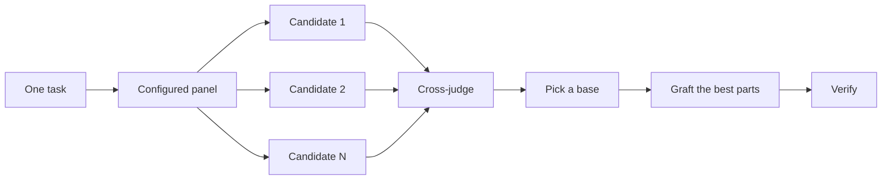
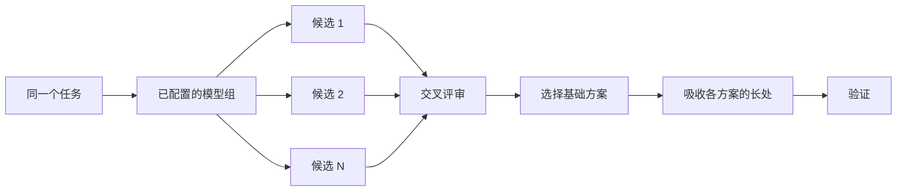

<!-- Generated by scripts/bilingual.py. Source SHA256: 31f2abe6e9b29feafd1a9eece8f4fe21992f86b8c19ab2e9b5c11a20f36587e7 -->
[英文源文件 / English source](../../../guide/04-design.md)

<!-- en:0 -->
# Design before you write code

<!-- zh:0 -->
**写代码之前先设计**

<!-- en:1 -->
One attempt at a hard design locks in the first shape the model thought of. `/architect` settles types and boundaries before implementation. `/arena` runs several attempts at the same brief and merges the best parts. `/interrogate` has other models try to break the result. When the job is coverage rather than design synthesis, `/swarm` fans out slices or races and aggregates their results.

<!-- zh:1 -->
复杂设计如果只尝试一次，很容易固化成模型最先想到的方案。`/architect` 在实现前确定类型与边界。`/arena` 针对同一份任务说明并行尝试多个方案，再综合各方案的长处。`/interrogate` 让其他模型尝试找出结果中的问题。如果目标是扩大检查覆盖，而不是综合设计方案，`/swarm` 会分派不同的任务范围或候选竞赛，再汇总结果。

<!-- en:2 -->
The two most common design mistakes are taking the agent's first design and polishing a plan that no code has tested. This page fixes both. You plan through code: prototypes answer the open questions, a README or tutorial sets the target, and the written plan comes last.

<!-- zh:2 -->
两种最常见的设计错误，是接受 agent 的第一个设计，以及打磨未经代码检验的计划。本页处理这两个问题。通过代码规划：用原型回答未决问题，用 README 或教程设定目标，最后再写计划。

<!-- en:3 -->


<!-- en:4 -->
## Settle the shape with `/architect`

<!-- zh:4 -->
**用 `/architect` 确定设计形态**

<!-- en:5 -->
```text
/architect design the import pipeline before writing any code. i care most about how callers use it.
```

<!-- zh:5 -->
```text
/architect 写代码之前先设计导入流水线。我最关心调用方怎么使用它。
```

<!-- en:6 -->
[`/architect`](../../skills/architect/SKILL.md) grounds itself first, running `/how` over the code the design touches and `/why` when it moves ownership or layers. Then it runs `/arena` to produce competing design sketches, with the caller's usage written first in each, followed by types, signatures, and a module map.

<!-- zh:6 -->
[`/architect`](../../skills/architect/SKILL.md) 首先了解现有系统，对设计涉及的代码运行 `/how`；如果改动涉及职责归属或分层，还会运行 `/why`。然后用 `/arena` 产出相互竞争的设计草案。每个草案都先写调用方的使用方式，再给出类型、函数签名和模块关系图。

<!-- en:7 -->
By default it proceeds straight from the synthesized design into implementation. If you want to see the design first, say so:

<!-- zh:7 -->
默认情况下，综合出设计后，它会直接进入实现。如果你想先查看设计，请明确说明：

<!-- en:8 -->
```text
/architect with checkpoint. stop and show me before implementing.
```

<!-- zh:8 -->
```text
/architect 设置检查点。开始实现前停下来，把设计给我看。
```

<!-- en:9 -->
The design isn't sacred once code starts. If implementation shows the same workaround in unrelated places, or types that only compile with `any` or forced casts, `/architect` treats that as proof the design is wrong. It scraps the sketch and starts over instead of patching around it.

<!-- zh:9 -->
开始编码后，设计也可以推翻。如果实现中在互不相关的位置反复出现同一种变通做法，或类型只能靠 `any` 或强制类型转换才能编译，`/architect` 会将其视为设计错误的证据。它会丢弃草图重新设计，而不是在原设计周围打补丁。

<!-- en:10 -->
## Fan out attempts with `/arena`

<!-- zh:10 -->
**用 `/arena` 并行尝试方案**

<!-- en:11 -->
```text
/arena take my prompt to the arena verbatim. i want to compare their proposals with yours.
```

<!-- zh:11 -->
```text
/arena 把我的提示词原样交给各个候选。我想把它们的方案与你的方案对比。
```

<!-- en:12 -->
[`/arena`](../../skills/arena/SKILL.md) is the general tool underneath. N subagents attempt the same design or code brief in parallel, each writing to its own worktree or directory. A read-only judge, on a different model family when your configuration allows one, scores every candidate against a rubric. The coordinator reads each candidate end to end, picks a base, grafts in the best ideas from the losers, and verifies the result.

<!-- zh:12 -->
[`/arena`](../../skills/arena/SKILL.md) 是底层的通用工具。N 个 subagent 并行处理同一份设计或代码任务说明，各自在独立 worktree 或目录中写入产物。只读评审者按照评分标准评估所有候选；配置允许时，评审者使用不同系列的模型。协调者从头到尾阅读每个候选，选择一个作为基础，吸收其他候选中最好的思路，最后验证综合结果。

<!-- en:13 -->


<!-- zh:13 -->


<!-- en:14 -->
The panel comes from your [`/setup-pstack`](../../skills/setup-pstack/SKILL.md) configuration, and you can adjust it per task. Ask for more candidates when the decision matters, fewer when it doesn't:

<!-- zh:14 -->
模型组由 [`/setup-pstack`](../../skills/setup-pstack/SKILL.md) 配置，也可以针对单个任务调整。决策影响大时增加候选数量，影响小时减少：

<!-- en:15 -->
```text
/arena this, 5 candidates. the cache key format is expensive to change later.
```

<!-- zh:15 -->
```text
/arena 处理这个任务，给出 5 个候选方案。缓存键格式以后修改成本很高。
```

<!-- en:16 -->
## Cover slices and races with `/swarm`

<!-- zh:16 -->
**用 `/swarm` 覆盖不同范围或运行竞赛**

<!-- en:17 -->
```text
/swarm check every package under packages/ against its check.sh. one worker per package. one report.
```

<!-- zh:17 -->
```text
/swarm 按各自的 check.sh 检查 packages/ 下的每个包。每个包一个 worker，最终给我一份报告。
```

<!-- en:18 -->
[`/swarm`](../../skills/swarm/SKILL.md) fans N workers across independent slices, coverage matrices, gauntlet lanes, exploration partitions, or declared race arms. Each worker gets its own scope and check, then reports `PASS`, `ISSUES`, or `BLOCKED`. The parent waits for the workers and returns one compact report with any gaps or dropouts.

<!-- zh:18 -->
[`/swarm`](../../skills/swarm/SKILL.md) 把 N 个 worker 分派到独立任务范围、覆盖矩阵、测试通道、探索分区，或明确声明的竞赛候选。每个 worker 都有自己的范围和检查要求，最后报告 `PASS`、`ISSUES` 或 `BLOCKED`。主 agent 等待所有 worker 结束，给出一份简明报告，并指出遗漏或未完成的任务。

<!-- en:19 -->
Reach for it when parallelism buys coverage or lets independent checks race. `/arena` gives every worker the same design or code brief, then picks a base and grafts the best parts. `/swarm` covers slices or runs a race with a selection rule declared up front. It does not use the base-selection and grafting ceremony.

<!-- zh:19 -->
当并行执行能扩大覆盖范围，或让独立检查相互竞赛时，使用它。`/arena` 把同一份设计或代码任务说明交给每个 worker，再选择基础方案并吸收各方案的长处。`/swarm` 则覆盖不同范围，或按事先声明的选择规则运行竞赛，不进行选基础方案和综合方案的流程。

<!-- en:20 -->
## Break it with `/interrogate`

<!-- zh:20 -->
**用 `/interrogate` 挑战结果**

<!-- en:21 -->
```text
/interrogate the whole branch, but skeptically. no nitpicks unless it's an actual bug or regression.
```

<!-- zh:21 -->
```text
/interrogate 带着怀疑审查整个分支。只报告实际 bug 或回归问题，不要挑无关紧要的小毛病。
```

<!-- en:22 -->
[`/interrogate`](../../skills/interrogate/SKILL.md) sends the same diff, intent, and rubric to reviewers on different model families. Model diversity is the point. Different models have different blind spots, so a finding two models raise independently is high-confidence signal. The lead sorts everything into `Act on`, `Consider`, `Noted`, and `Dismissed`, with a reason for each dismissal, and applies nothing automatically.

<!-- zh:22 -->
[`/interrogate`](../../skills/interrogate/SKILL.md) 将同一份 diff、意图和评审准则发给不同模型家族的评审者。关键是模型多样性。不同模型有不同盲点，因此两个模型独立提出的同一问题是高可信度信号。主评审将结果分为 `Act on`、`Consider`、`Noted` 和 `Dismissed`，说明每项驳回的理由，不会自动应用任何结果。

<!-- en:23 -->
Read the dismissals too. The lead is a pragmatic senior engineer, not an oracle, and you can override it.

<!-- zh:23 -->
被驳回的发现也值得阅读。负责人相当于一位务实的资深工程师，不是绝不会错的权威；你可以推翻它的判断。

<!-- en:24 -->
## Prototype instead of debating

<!-- zh:24 -->
**用原型代替争论**

<!-- en:25 -->
Never take the first design. Ask for a few, and pick from evidence you can see:

<!-- zh:25 -->
不要接受第一个设计。要求几个方案，根据可见证据选择：

<!-- en:26 -->
```text
/poteto-mode prototype a few options for the new dropdown menu. take screenshots or videos for me to compare.
```

<!-- zh:26 -->
```text
/poteto-mode 为新的下拉菜单做几个方案的原型。提供截图或视频供我比较。
```

<!-- en:27 -->
The [Prototype playbook](../../skills/poteto-mode/playbooks/prototype.md) builds throwaway sketches in a scratch directory, puts the variants behind one switcher, drives each one, and captures screenshots or timings. It also works for behavior and algorithms, not just UI. Prototypes are planning with code. They let the agent answer its own open questions by running something instead of asking you, and they leave room for an option you wouldn't have thought of.

<!-- zh:27 -->
[原型执行规程](../../skills/poteto-mode/playbooks/prototype.md) 在临时目录中构建可丢弃的草图，通过同一个切换器展示各方案，实际操作每个方案，并记录截图或耗时。它也适用于行为与算法，不只适用于 UI。原型是用代码做规划。agent 可以通过运行实际产物回答自己的未决问题，不必都问你，同时也给你未曾想到的方案留下空间。

<!-- en:28 -->
The same idea scales up to a real design. Pair `/architect` with prototypes and keep a review gate:

<!-- zh:28 -->
同样的思路也适用于正式设计。结合 `/architect` 和原型，并保留审查关卡：

<!-- en:29 -->
```text
/poteto-mode we need rate limiting for external webhooks. /architect it first, and answer open questions with prototypes. let me review before proceeding.
```

<!-- zh:29 -->
```text
/poteto-mode 我们需要为外部 webhook 加限流。先用 /architect 设计，并通过原型回答未决问题。继续之前先让我审查。
```

<!-- en:30 -->
Don't spend reviewers on an abstract plan. `/interrogate` belongs on a diff. Point adversarial review at a plan with no code behind it and the reviewers invent theoretical risks and edge cases that will never happen. Let prototypes settle the questions, then review what got built.

<!-- zh:30 -->
不要将评审资源花在抽象计划上。`/interrogate` 应用于 diff。对没有代码支撑的计划做对抗性评审，会让评审者虚构不会发生的理论风险和边界情况。先让原型解决问题，再评审实际产物。

<!-- en:31 -->
## Write the README first for shared code

<!-- zh:31 -->
**共享代码先写 README**

<!-- en:32 -->
For a package or API that other code will use, start with the doc a user would read:

<!-- zh:32 -->
对于其他代码会使用的软件包或 API，先写使用者会阅读的文档：

<!-- en:33 -->
```text
/poteto-mode write a tutorial for how i would use the new config package first. then /teach me why it beats the current one.
```

<!-- zh:33 -->
```text
/poteto-mode 先写一份教程，说明我如何使用新的配置包。然后用 /teach 解释它为什么优于当前方案。
```

<!-- en:34 -->
Writing the tutorial first forces the caller's view. You describe the API to a hypothetical user and work back to the implementation. The doc also becomes a concrete target the agent checks its own work against. Name [`/technical-writing`](../../skills/technical-writing/SKILL.md) when the doc itself matters, so a tutorial stays a tutorial instead of drifting into reference and explanation at once.

<!-- zh:34 -->
先写教程会迫使你采用调用方视角。向假想用户描述 API，再反推实现。文档也会成为 agent 检查自身工作的具体目标。当文档本身很重要时，指定 [`/technical-writing`](../../skills/technical-writing/SKILL.md)，让教程保持为教程，不要同时混入参考手册与概念解释。

<!-- en:35 -->
## Plan after the design settles

<!-- zh:35 -->
**设计确定后再写计划**

<!-- en:36 -->
pstack has no planning skill, on purpose. When you do want a written plan, ask for it once the design is settled:

<!-- zh:36 -->
pstack 刻意不提供规划 skill。确实需要书面计划时，等设计确定后再提出：

<!-- en:37 -->
```text
/poteto-mode turn this design into a plan. small verifiable PRs, each with its own verification steps.
```

<!-- zh:37 -->
```text
/poteto-mode 将这个设计转为计划。拆成小而可验证的 PR，每个都有自己的验证步骤。
```

<!-- en:38 -->
The [Multi-phase plan playbook](../../skills/poteto-mode/playbooks/multi-phase-plan.md) settles any remaining open questions by prototype, then writes one section per PR, each ending in proof that the change works. A passing test suite alone doesn't count as that proof. The plan is the deliverable. The playbook doesn't implement it, and it names which execution playbook should run it next.

<!-- zh:38 -->
[多阶段规划执行规程](../../skills/poteto-mode/playbooks/multi-phase-plan.md) 通过原型解决剩余未决问题，再为每个 PR 编写一个章节，每章都以证明改动有效的证据结尾。仅仅测试套件通过不算这种证据。计划就是交付产物。该执行规程不实施计划，并会说明下一步应使用哪项执行规程。

<!-- en:39 -->
For a migration, state the bar in the prompt:

<!-- zh:39 -->
迁移时，在提示词中明确标准：

<!-- en:40 -->
```text
/poteto-mode plan the migration of our ui library to the new styling system. small verifiable PRs, each with visual regression checks. the result must match the original exactly, bugs included.
```

<!-- zh:40 -->
```text
/poteto-mode 规划将我们的 ui 库迁移到新的样式系统。拆成小而可验证的 PR，每个都有视觉回归检查。结果必须与原来完全一致，包括 bug。
```

<!-- en:41 -->
"bugs included" keeps the migration from quietly fixing things on the way, which would make the old and new output impossible to compare. For a project that spans many days, you can commit the plan to the repo for a while so other agents see the work in progress. Delete it when the work lands.

<!-- zh:41 -->
“包括 bug”能防止迁移过程中悄悄修复问题，否则新旧输出将无法比较。对于持续多日的项目，可以暂时将计划提交到仓库，让其他 agent 看见进行中的工作。工作合入后删除计划。

<!-- en:42 -->
## How much design work does a task deserve?

<!-- zh:42 -->
**一个任务值得投入多少设计工作？**

<!-- en:43 -->
You might be wondering whether every change needs this. No. Most changes need none of it. A rough ladder:

<!-- zh:43 -->
你可能想问，每项改动都需要这些步骤吗？不需要。多数改动都用不上。大致可以这样判断：

<!-- en:44 -->
- A small, finished change you're unsure about needs `/interrogate` alone.
- A change that crosses function boundaries or moves ownership earns `/architect`, which brings `/arena` with it.
- A standalone decision where independent attempts would help, like naming, formats, or an algorithm, is `/arena` directly.
- A coverage matrix, set of parallel checks, or race with declared arms is `/swarm`.
- An open question you could answer by running something, like a layout, a timing, or an approach, gets a prototype, not a debate.
- A contested design that's expensive to reverse gets `/architect`, then `/interrogate` before shipping.
- Work that spans several PRs gets a plan, written after the design settles.

<!-- zh:44 -->
- 对已经完成的小改动拿不准，只需 `/interrogate`。
- 改动跨越函数边界或转移职责归属时，使用 `/architect`，它会带上 `/arena`。
- 独立尝试有帮助的单项决策，如命名、格式或算法，直接用 `/arena`。
- 覆盖矩阵、并行检查集合或明确指定参赛方案的竞赛，用 `/swarm`。
- 能通过运行产物回答的未决问题，如布局、耗时或实现方法，用原型解决。
- 存在争议且难以撤回的设计，先用 `/architect`，交付前再用 `/interrogate`。
- 跨多个 PR 的工作，在设计确定后编写计划。

<!-- en:45 -->
`/poteto-mode` already applies this ladder. Boundary-crossing work triggers `/architect` on its own, so you reach for these directly mainly when you want more or less scrutiny than the default.

<!-- zh:45 -->
`/poteto-mode` 已经按这套标准决策。跨越边界的工作会自动触发 `/architect`，所以直接调用这些 skill，主要是为了比默认流程增加或减少审查力度。

<!-- en:46 -->
Next: [Build and clean the change](./05-build-and-clean.md).

<!-- zh:46 -->
下一页：[实现并整理改动](./05-build-and-clean.md)。
