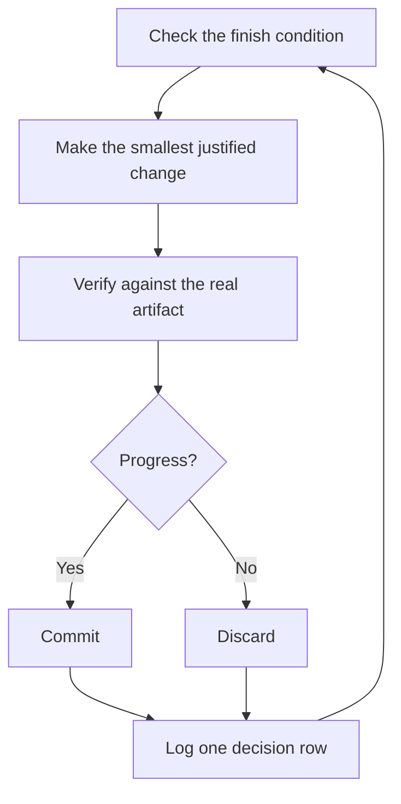
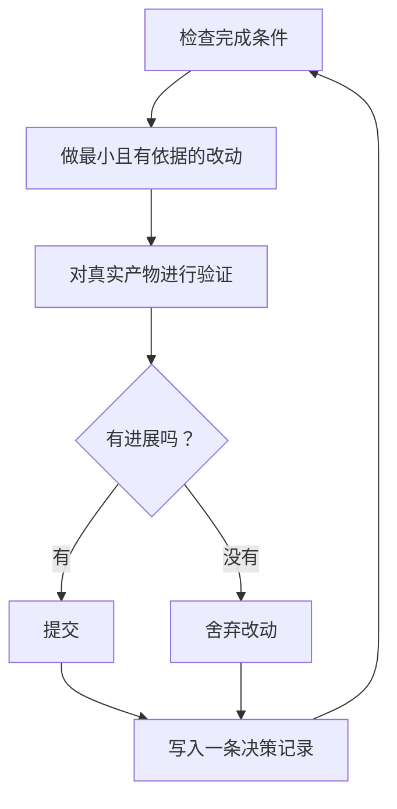

<!-- Generated by scripts/bilingual.py. Source SHA256: d7bd33a3d880768688dff4c1c2b5481ca9f0f194f5d97e44b65c9f96624d3ff0 -->
[英文源文件 / English source](../../../guide/07-overnight.md)

<!-- en:0 -->
# Run work while you sleep

<!-- zh:0 -->
**让任务在你休息时继续**

<!-- en:1 -->
This is the payoff for everything before it. An agent you can trust to verify its own work is an agent you can leave alone with a hard task. What makes that safe isn't hope. It's a checkable finish condition, an isolated worktree or cloud agent, and a decision log you audit in the morning.

<!-- zh:1 -->
前面所有准备的收益就在这里。能可靠验证自身工作的 agent，才适合独立处理困难任务。保障来自可检查的完成条件、隔离的 worktree 或云端 agent，以及你早上可审查的决策日志。

<!-- en:2 -->


<!-- en:3 -->
## Earn the trust before the loop

<!-- zh:3 -->
**循环运行前先建立信任**

<!-- en:4 -->
A loop you don't trust just produces unchecked work faster, and the mess compounds with every iteration. Before you leave one running, check that it has earned it:

<!-- zh:4 -->
不可信的循环只会更快地产生未经检查的工作，每次迭代都会加重混乱。让它独立运行前，先确认以下条件：

<!-- en:5 -->
- You've done the task once by hand, or watched an agent do it, so you know what good looks like.
- The agent has the tools and signals you'd use yourself: the verification skill, the profiler, the logs.
- Every stage proves its work and can stop the line when the work misses the bar.
- You've read a few transcripts and turned the repeated failures into tools, skills, or checks.

<!-- zh:5 -->
- 你亲手做过一次任务，或看过 agent 完成它，知道合格结果是什么。
- agent 拥有你自己会使用的工具与信号：验证 skill、性能分析器和日志。
- 每个阶段都能证明自己的工作，达不到标准时可以停止整个流程。
- 你读过几份对话记录，并将反复出现的失败转为工具、skill 或检查。

<!-- en:6 -->
Make the loop autonomous only after all four hold. Until then, run it while you watch.

<!-- zh:6 -->
四项全部满足后，才让循环自主运行。在此之前，观察着它执行。

<!-- en:7 -->
## The overnight contract

<!-- zh:7 -->
**夜间执行约定**

<!-- en:8 -->
A good handoff has the goal, the finish condition, permissions, and an escape hatch. It doesn't need to be long:

<!-- zh:8 -->
一次有效交接要包含目标、完成条件、权限，以及无法继续时的退出机制。不必写很长：

<!-- en:9 -->
```text
/poteto-mode im going to bed. migrate every caller to the new parser in a fresh worktree off <base>.
done means zero old callers, all parser fixtures pass, old api deleted.
keep a decision log. don't ask me before committing.
/loop until done. if you're truly stuck after a few hours, stop and write up why.
```

<!-- zh:9 -->
```text
/poteto-mode 我要睡了。在从 <base> 创建的新 worktree 中，把所有调用方迁移到新 parser。
完成条件是旧调用方为零、所有 parser 测试样本通过、旧 API 已删除。
保留决策记录。提交前不必问我。
/loop 持续执行直到完成。如果几个小时后确实卡住了，就停止并写清原因。
```

<!-- en:10 -->
Walk through what each line buys you:

<!-- zh:10 -->
逐行看它们解决了什么问题：

<!-- en:11 -->
- "im going to bed" is a session override. The agent stops asking and keeps going.
- "done means..." turns the goal into checks every iteration can run.
- "fresh worktree off `<base>`" keeps the run from colliding with anything else you have open.
- "don't ask me before committing" pre-answers the permission the agent would otherwise block on.
- `/loop` is Cursor's built-in wake mechanism, not a pstack skill. The [Autonomous run playbook](../../skills/poteto-mode/playbooks/autonomous-run.md) uses it to re-check the finish condition on events or a heartbeat.
- The escape hatch lets it stop at a genuine dead end and write up why, which beats eight hours of creative goal reinterpretation.

<!-- zh:11 -->
- “我要睡了”会覆盖本次会话的交互约定，让 agent 不再反复询问，继续执行。
- “完成条件是……”把目标转成每轮都可以执行的检查。
- “从 `<base>` 创建的新 worktree”避免这次执行与其他正在进行的工作相互干扰。
- “提交前不必问我”提前给出权限，避免 agent 因等待授权而停住。
- `/loop` 是 Cursor 内置的唤醒机制，不是 pstack skill。[Autonomous run 执行规程](../../skills/poteto-mode/playbooks/autonomous-run.md) 用它在事件触发或定时心跳时重新检查完成条件。
- 退出机制允许 agent 遇到真正无法推进的障碍时停下并说明原因，优于花八小时不断重新解释目标。

<!-- en:12 -->
Because you'll review this work after stepping away, `/poteto-mode` routes it through [`/figure-it-out`](../../skills/figure-it-out/SKILL.md), which designs the run's phases before any code and wires in the decision log.

<!-- zh:12 -->
因为你会在离开后再复核工作，`/poteto-mode` 会把任务交给 [`/figure-it-out`](../../skills/figure-it-out/SKILL.md)，在写代码前设计执行阶段，并接入决策记录。

<!-- en:13 -->
To stop a run on purpose, tell the agent to pause, or that you're about to go offline or restart Cursor. The [Pause safely playbook](../../skills/poteto-mode/playbooks/pause-safely.md) finishes or backs out of the current step, commits a work-in-progress checkpoint, and writes a resume note. A fresh chat picks the work up from that note through the Session pickup playbook. Saying "keep going" never triggers a pause.

<!-- zh:13 -->
要主动停止运行，告诉 agent 暂停，或说明你即将离线或重启 Cursor。[安全暂停执行规程](../../skills/poteto-mode/playbooks/pause-safely.md) 会完成或撤回当前步骤，提交进行中的工作检查点，并写下恢复说明。新对话通过 Session pickup 执行规程读取该说明，继续工作。“继续执行”绝不会触发暂停。

<!-- en:14 -->
## What the loop does all night

<!-- zh:14 -->
**整夜循环做什么**

<!-- en:15 -->


<!-- zh:15 -->


<!-- en:16 -->
One change, one check, one log row, every iteration. Changes that didn't help get discarded, not left to ride. A plateau means pivot, not stop, and the finish condition never quietly relaxes to declare victory.

<!-- zh:16 -->
每轮只做一项改动、一次检查、记录一条决策。没有帮助的改动要舍弃，不能混在结果里保留。进入瓶颈意味着换一个思路，而不是停止；也不能悄悄放宽完成条件来宣布成功。

<!-- en:17 -->
## The morning audit

<!-- zh:17 -->
**第二天如何复核**

<!-- en:18 -->
[`/show-me-your-work`](../../skills/show-me-your-work/SKILL.md) is what makes the run reviewable. Each row records the time, phase, decision, reason, an evidence pointer, and the result, in a TSV at `decisions.tsv` (or `.audit/<task-slug>.tsv` when several runs share a directory). It stays local by default. Commit it when the work is ambitious enough that a reviewer needs the trail to trust the result.

<!-- zh:18 -->
[`/show-me-your-work`](../../skills/show-me-your-work/SKILL.md) 让执行过程可复核。每条记录包含时间、阶段、决策、理由、证据位置和结果，写入 `decisions.tsv`；多个任务共享目录时，则写入 `.audit/<task-slug>.tsv`。默认只保存在本地。如果工作规模大到评审者需要完整过程才能信任结果，就把记录一并提交。

<!-- en:19 -->
When you're back, ask for the run in review form:

<!-- zh:19 -->
回来后，可以要求按复核视角汇报：

<!-- en:20 -->
```text
/show-me-your-work catch me up on what you did last night
```

<!-- zh:20 -->
```text
/show-me-your-work 帮我回顾昨晚做了什么
```

<!-- en:21 -->
Before the skill hands back its summary, it spawns a reviewer on a different model family to read the trail and the transcript, and the reply ends with an Attention section listing what deserves your scrutiny. Read that section first, then the log rows it points at. You're auditing decisions, not re-reading the whole night.

<!-- zh:21 -->
生成摘要之前，这个 skill 会启动一个不同模型系列的评审者，阅读记录和对话。回复最后的 Attention 部分列出值得你重点检查的事项。先读这一部分，再查看它引用的记录行。你要复核的是决策，而不是重读一整夜的对话。

<!-- en:22 -->
## When the night holds a queue, not a task

<!-- zh:22 -->
**当夜间工作是一组任务**

<!-- en:23 -->
The contract above drives one task to one finish condition. Some nights hold more, a queue of independent changes or a whole program. Three playbooks scale the same trust up.

<!-- zh:23 -->
上述约定把一个任务推进到一个完成条件。有些夜间工作是一组独立改动，甚至整个项目计划。下面三套执行规程把同样的验证机制扩展到更大范围。

<!-- en:24 -->
[Autopilot-full](../../skills/poteto-mode/playbooks/autopilot-full.md) runs a queue of independent PRs to merged. Each PR gets one owner agent that carries it from build through merge, and no owner merges on its own verdict. A swarm of fresh verifiers starts a round at the owner's code-ready head and again at every later push that changes the patch. Only a clean verdict on the patch that merges authorizes the merge:

<!-- zh:24 -->
[Autopilot-full](../../skills/poteto-mode/playbooks/autopilot-full.md) 把一组独立 PR 推进到合入。每个 PR 有一个负责 agent，从实现一路负责到合并，但任何负责 agent 都不能仅凭自己的判断合并。新启动的一组验证者会在负责 agent 达到代码就绪的 commit 处启动一轮验证，并在后续每次改动补丁的推送时再次启动。只有对最终合入补丁给出的干净通过结论，才能授权合并：

<!-- en:25 -->
```text
/poteto-mode full autopilot on this queue. each item is independent. i want them merged by morning.
```

<!-- zh:25 -->
```text
/poteto-mode 对这个队列全自动执行。每项任务互相独立。我希望明早之前全部合入。
```

<!-- en:26 -->
[Autopilot-stack](../../skills/poteto-mode/playbooks/autopilot-stack.md) runs the same owner loop but ships nothing. You wake up to one linear base-branch stack with a verifier's verdict on every link, and you review and land it yourself. Pick it over Autopilot-full when the changes are coupled, or when you want your own eyes on the work before anything merges:

<!-- zh:26 -->
[Autopilot-stack](../../skills/poteto-mode/playbooks/autopilot-stack.md) 使用相同的负责者循环，但不执行合入。第二天你会得到一个线性的基线分支 PR 栈，每一环都有验证者的判断，由你自行评审并合入。如果改动相互依赖，或你希望所有改动合并前都亲自看过，应选择它而不是 Autopilot-full：

<!-- en:27 -->
```text
/poteto-mode autopilot these five changes but stack them, don't ship. i'll land the stack in the morning.
```

<!-- zh:27 -->
```text
/poteto-mode 自动推进这五项改动，但组织成 PR 栈，不要合入。我明早自己合入。
```

<!-- en:28 -->
[Orchestrate](../../skills/poteto-mode/playbooks/orchestrate.md) is for a program that outlives any single agent: multi-day, many stacked PRs, fleets of subagents under one standing coordinator chat. The coordinator authors briefs, collects what its subagents finish, keeps the lowest unmerged PR green, and never writes code itself. It's deliberately heavy machinery. If one agent could finish the work in a session, the playbook itself routes you back to the overnight contract above:

<!-- zh:28 -->
[Orchestrate](../../skills/poteto-mode/playbooks/orchestrate.md) 用于超过单个 agent 生命周期的项目级工作：持续多天、包含多个相互依赖的 PR，由一个长期协调对话管理大量 subagent。协调者编写任务说明、收集 subagent 的完成结果、让最底层尚未合入的 PR 保持检查通过，自己从不写代码。这套机制刻意设计得较重。如果一个 agent 能在一次会话内完成，执行规程会把你引回上面的夜间执行约定：

<!-- en:29 -->
```text
/poteto-mode orchestrate the store migration. own it until every package is converted and merged. i'll check in twice a day.
```

<!-- zh:29 -->
```text
/poteto-mode 协调 store 迁移。一直负责，直到每个包都完成迁移并合入。我每天查看两次进展。
```

<!-- en:30 -->
## Run many projects in parallel

<!-- zh:30 -->
**并行运行多个项目**

<!-- en:31 -->
A [Cursor Project](https://cursor.com/blog/projects) gives one coordinator agent a persistent thread. The coordinator doesn't write code. It directs subagents, which run in the cloud by default, so the work continues when your laptop is closed. That's the shape the Orchestrate playbook expects. Start your prompts to the coordinator with `/poteto-mode`, and the subagents it spawns follow the playbooks.

<!-- zh:31 -->
[Cursor Project](https://cursor.com/blog/projects) 为协调 agent 提供持久对话线程。协调者不写代码，而是指挥 subagent；subagent 默认在云端运行，所以关闭笔记本后工作仍会继续。这正是 Orchestrate 执行规程预期的结构。发给协调者的提示词以 `/poteto-mode` 开头，它启动的 subagent 就会遵循执行规程。

<!-- en:32 -->
A few habits help:

<!-- zh:32 -->
几个习惯会有帮助：

<!-- en:33 -->
- Give each body of work its own Project, such as a feature, a migration, a perf push, or a tech-debt cleanup. Several can run side by side.
- Drag related chats into the Project, finished ones included. They become context for every agent in it.
- Give each PR a verification swarm before it merges, and let Autopilot-stack or Autopilot-full carry the queue.
- Ask the coordinator for a plan backed by data, and have it answer open questions with prototypes before it asks you.

<!-- zh:33 -->
- 每项独立工作使用自己的 Project，如功能开发、迁移、性能优化或技术债清理。多个 Project 可以同时运行。
- 将相关对话拖入 Project，包括已完成的对话。它们会成为该 Project 中所有 agent 的上下文。
- 每个 PR 合入前安排一次验证 swarm，让 Autopilot-stack 或 Autopilot-full 处理队列。
- 要求协调者提供数据支持的计划，并在向你提问前用原型回答未决问题。

<!-- en:34 -->
One prompt can carry a whole Project, from research through execution:

<!-- zh:34 -->
一条提示词可以覆盖整个 Project，从研究到执行：

<!-- en:35 -->
```text
/poteto-mode refactor this repo so its architecture is more agent friendly. use /correct and /architect on past commits and review comments to find the mistakes agents make most here. use /recall for context from past chats. answer open questions with prototypes instead of asking me. come back with a plan backed by real data. once i approve it, run it with autopilot-stack or autopilot-full, and ask me which.
```

<!-- zh:35 -->
```text
/poteto-mode 重构这个仓库，让架构更适合 agent 工作。用 /correct 和 /architect 分析历史提交和评审评论，找出 agent 在这里最常犯的错误。用 /recall 获取以往对话的上下文。通过原型回答未决问题，不要问我。提供真实数据支持的计划。等我批准后，用 autopilot-stack 或 autopilot-full 执行，先问我选哪一个。
```

<!-- en:36 -->
## Let loops start themselves

<!-- zh:36 -->
**让循环自行启动**

<!-- en:37 -->
Every loop above still waits for you to start it. A scheduled or event-driven automation removes that step. Software maintenance splits into stages that suit this well: triage a report, reproduce it, fix it, verify the fix. Two rules keep such a line trustworthy:

<!-- zh:37 -->
上面的循环仍需要你启动。定时或事件驱动的自动化可以省去这一步。软件维护很适合拆成几个阶段：分诊报告、复现、修复、验证修复。两条规则能让这样的流程值得信赖：

<!-- en:38 -->
- Every stage can stop the line. Triage can decide the report is expected behavior, repro can fail to reproduce it, and the fixer can judge the change too risky. Each of those outcomes is useful, because it keeps bad work from reaching the next stage, where it costs more to undo.
- Every stage hands over evidence. Repro attaches screenshots and video of the broken state, and the fix attaches before-and-after proof. A human can then check that the agent fixed the right thing before reading a line of code.

<!-- zh:38 -->
- 每个阶段都能停止流程。分诊可以判断报告描述的是预期行为，复现可以发现无法复现，修复者可以判定改动风险过高。这些结果都有用，能阻止不合适的工作进入下一阶段，避免更高的撤回成本。
- 每个阶段都移交证据。复现阶段附上异常状态的截图和视频，修复阶段附上前后对比证据。这样，人可以在阅读代码之前检查 agent 是否修复了正确的问题。

<!-- en:39 -->
pstack ships this as a dormant [automation pack](../../automations/benny/README.md) for Slack issue reports. One automation triages each report. The other reproduces confirmed bugs and may prepare a small draft fix. Point an agent at its [`FOR_AGENTS.md`](../../automations/benny/FOR_AGENTS.md) and name the target repository to set it up.

<!-- zh:39 -->
pstack 为 Slack 问题报告提供了默认未启用的 [自动化包](../../automations/benny/README.md)。一项自动化对每份报告进行分诊，另一项复现已确认的 bug，并可能准备一个小型修复草稿。让 agent 阅读它的 [`FOR_AGENTS.md`](../../automations/benny/FOR_AGENTS.md)，并指定目标仓库，即可配置。

<!-- en:40 -->
**Pitfall:** a duration is not a finish condition. "work on this for 4 hours" gives the agent nothing to check, and you'll wake up to four hours of motion instead of a result. Give `/loop` a predicate that can pass or fail.

<!-- zh:40 -->
**易错点：** 执行时长不是完成条件。“做四个小时”没有可检验的结果，第二天得到的可能只是四小时的忙碌，而不是成果。给 `/loop` 一个能明确判定通过或失败的条件。

<!-- en:41 -->
Next: [Steer with principle names](./08-principles.md).

<!-- zh:41 -->
下一页：[用原则名称调整方向](./08-principles.md)。
